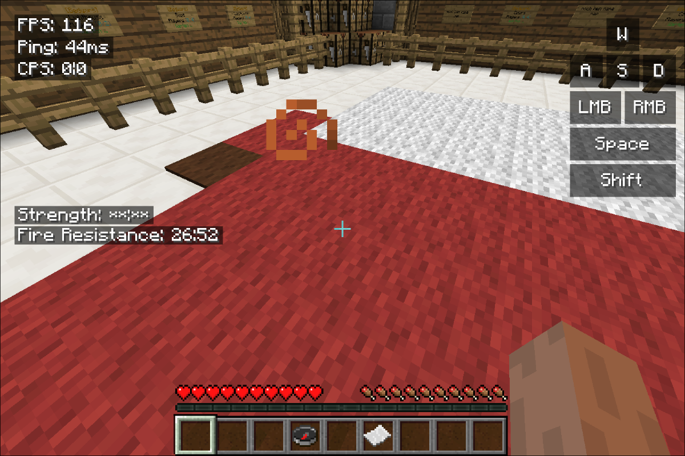
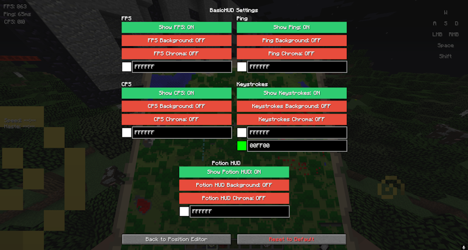

# BasicHUD

**BasicHUD** is a lightweight Forge mod for Minecraft 1.8.9 that displays basic information on screen.

## Features

* **Stats Display:** Real-time FPS, Ping, CPS and Keystrokes.
* **Customization:** Fully configurable position, text colors and on/off toggle.
* **GUI:** Built-in config menu for easy adjustments.

## Installation

1.  Download the latest `.jar` from the **[Releases](https://github.com/Marschi47/BasicHUD/releases)** tab.
2.  Make sure you have **Minecraft Forge 1.8.9** installed.
3.  Drop the file into your `.minecraft/mods` folder.

## Usage

* The HUD appears automatically when you join a world or server.
* **To edit settings:** Open the Forge Mod menu and access the config menu through the config button.

## Screenshots






## Building from Source

If you want to compile the mod yourself:

1.  Clone this repository.
2.  Run the build command:
    ```bash
    ./gradlew build
    ```
3.  The output file will be in `build/libs`.

## Credits

* Created by **Marschi47**.
* Based on [Forge1.8.9Template by lineargraph](https://github.com/lineargraph/Forge1.8.9Template).