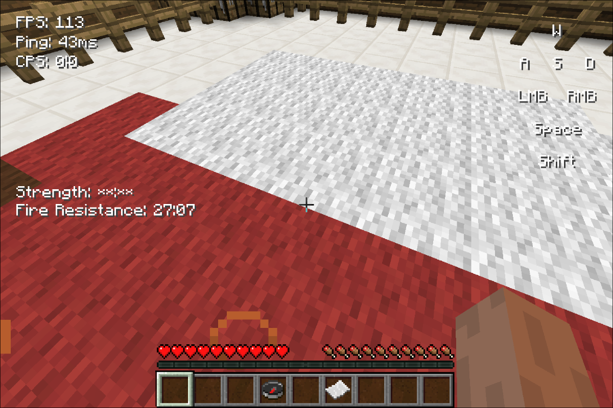
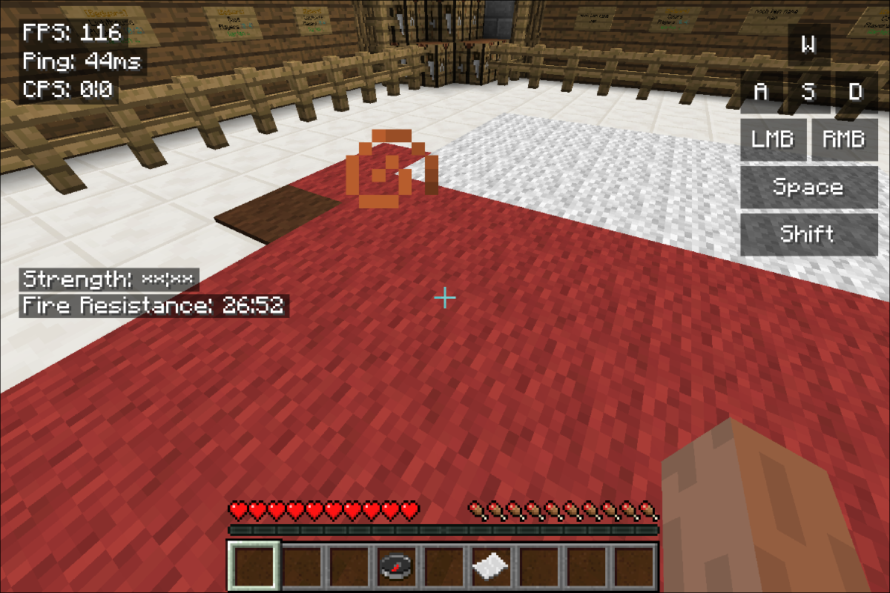
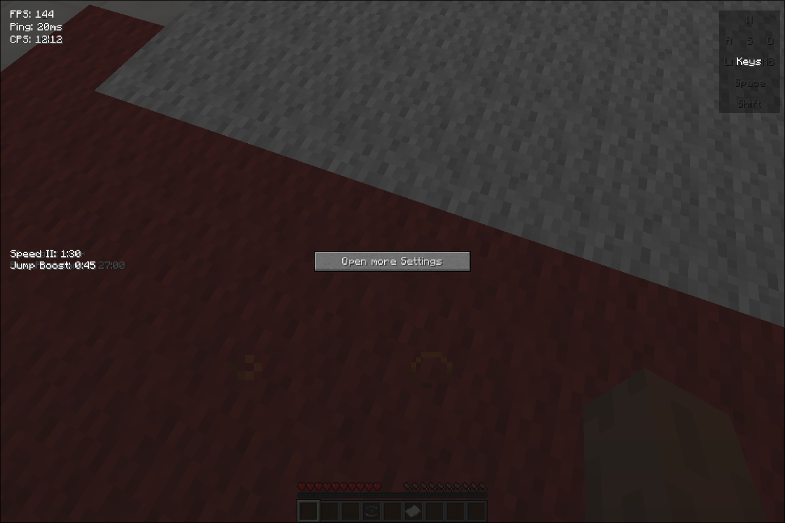
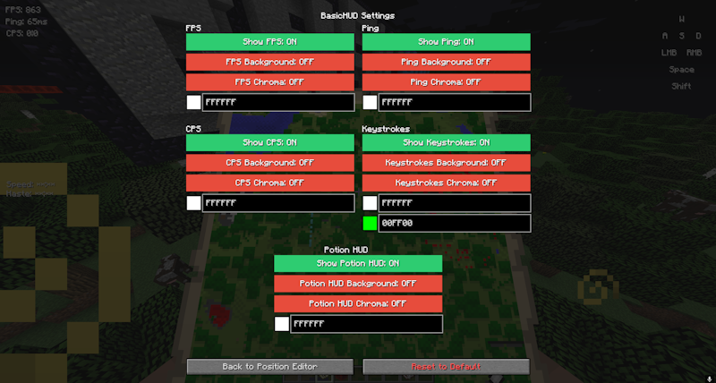

# BasicHUD

**BasicHUD** is a Forge mod for Minecraft 1.8.9 that displays basic information as a customizable HUD.

## Features

* **Stats Display:** Real-time FPS, Ping, CPS, Keystrokes and active Potion Effects.
* **Customization:** Fully configurable position, text colors (incl. RGB/Chroma), background and on/off toggle.
* **GUI:** Built-in config menu (default Shortcut: K) for easy adjustments.

## Installation

#### Download jar file manually
1.  Download the latest `.jar` from **[Modrinth](https://modrinth.com/mod/basichud)** / **[Curseforge](https://www.curseforge.com/minecraft/mc-mods/basichud)** / the **[Releases](https://github.com/Marschi47/BasicHUD/releases)** tab.
2.  Make sure you have **Minecraft Forge 1.8.9** installed.
3.  Drop the file into your `.minecraft/mods` folder.

#### Use Prism Launcher
1. Open Prism Launcher and select your Minecraft 1.8.9 Forge instance.
2. Click on Edit in the right-side menu.
3. Navigate to the Mods tab in the left sidebar and click Download Mods at the top right.
4. Search for BasicHUD (ensure Modrinth or CurseForge is selected as the source), select the mod, and click Review and Confirm.

#### Use Modrinth / Curseforge Lauchner
1. Use Modrinth / CurseForge Launcher
2. Open your Modrinth App or CurseForge Launcher.
3. Navigate to your Minecraft 1.8.9 Forge profile/instance.
4. Click the Add Mods button (Modrinth App) or Add More Content button (CurseForge).
5. Search for BasicHUD and click Install.

## Usage

* The HUD appears automatically when you join a world or server.
* **To edit settings:** Press K to open the config or open the Forge Mod menu and access the config menu through the config button.

## Screenshots






## Building from Source

If you want to compile the mod yourself:

1.  Clone this repository.
2.  Run the build command:
    ```bash
    ./gradlew build
    ```
3.  The output file will be in `build/libs`.

## Credits

* Created by [**Marschi47**](https://github.com/Marschi47).
* Based on [**Forge1.8.9Template by lineargraph**](https://github.com/lineargraph/Forge1.8.9Template).
